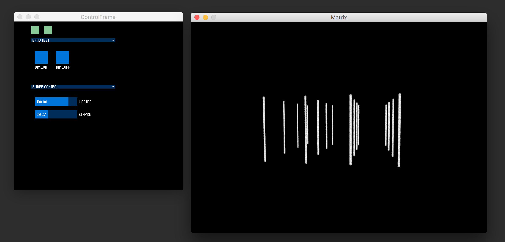

# Matrix &middot; [](http://makeapullrequest.com)

> :bulb::low_brightness: Control System for a interactive light installation :low_brightness::bulb:



It's prototyped in Processing.

## 0. Table of Contents  
- [Download](#1-download)
- [Run](#2-run)

## 1. Download

First, clone the project. Or you can just download as .zip.
```
git clone https://github.com/vibertthio/matrix-light-system.git matrix-light-system
cd matrix-light-system
```


## 2. Run

Second, open the file ./Matrix/Matrix.pde with your processing IDE.
